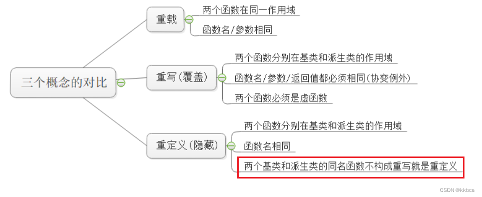

[c++面向对象b站视频](https://www.bilibili.com/video/BV1Esp7eFE54?p=57&vd_source=7bb03e841da18b1373084bf7955696c5)

# 三大特性

面向对象的三大特性:封装,继承,多态

封装: 将数据和操作数据的方法进行有机结合,隐藏对象的属性和实现细节,仅对外公开接口和对象进行交互.封装本质上是一种管理,让用户更方便使用类.

继承：允许新的类（子类）继承一个现有类（父类）的属性和方法。继承促进了代码的复用和模块化，通过继承一个基类，子类可以继承基类的所有特性，同时还可以添加新的特性或者覆盖基类中的方法。

多态：指同一操作在不同对象上有不同的表现形式。

有时也会说还有第四大特性，抽象
抽象：将一类对象的共同特征总结出来构造类的过程，包括数据抽象和行为抽象两方面。
抽象只关注对象有哪些属性和行为，并不关注这些行为的细节是什么。

例如：动物基本上都需要吃，那么就有“吃”这个行为抽象，也有体重，那么就有“体重”这个数据抽象属性了。

# cpp对c的增强

## 三目运算符的增强

## const的增强

## 枚举的增强

# 引用

# 常量指针

# 指针引用

# const的引用

# 内联函数

# 函数重载

## 函数重载和函数指针

# 类

## 类的封装

# 面向过程和面向对象

# 构造和析构函数

## 无参的构造和析构函数

# 拷贝构造函数

# 深拷贝和浅拷贝

# 构造函数初始化列表

# new和delete

# static

## static的占用大小

# this指针

# 友员函数

# 友员类和友员的关系

# 操作符重载

# 单目和双目运算符重载

# 左移右移操作符重载

# 自定义智能指针

# 自定义的string类

# 继承

## 类的继承

## 子类中的构造和析构

## 子类和父类的重名变量

## 继承中的static

# 多继承与虚继承

# 多态

# 虚析构函数

# 重载重写重定义

# 多态的原理

# 纯虚函数和抽象

# 纯虚函数和多继承

# 数组指针

# 函数指针

# 类默认自带的函数

默认构造函数
拷贝构造函数
赋值运算符
析构函数
移动构造函数
移动赋值运算符

# static

关键字声明的变量是静态局部变量

- 初始化: 只在第一次调用函数时进行一次初始化。
- 作用域: 仅在声明它的函数内可见。
- 存储: 存储在静态存储区中，直到程序结束。

Static 成员变量实现了同类对象间信息共享

static成员类外储存，求类的大小时并不包含在内。同时为类对象所共享，不属于某个具体实例

```cpp
class A
{
private:
        static int _n;
        int _k;
        char _a;
};
int main()
{
        cout << sizeof(A) << endl; //8，并没有包括静态成员变量_n
        return 0;
}
```

static成员是命名空间属于类的全局变量，存储在data区

static成员一般需要类外初始化（C++17 起，static inline/static constexpr 成员允许在类内初始化）

```cpp
class A
{
private:
        //声明
        static int _n;
        static int _k;
};
//定义
int A::_n = 0;
int A::_k = 0;
```

可以通过类名访问（无对象生成时亦可），也可以通过对象访问

静态成员函数没有隐藏的this指针，不能访问任何非静态成员

```cpp
class A
{
public:
        static void Func()
        {
                cout << ret << endl;  // err错误，访问了非静态成员，因为无this指针
                cout << _k << endl; //正确
        }
private:
        //声明
        int ret = 0;
        static int _k;
};
//定义
int A::_k = 0;
```

## 访问静态成员变量的特殊方式

对于公有的静态成员变量：

```cpp
class A
{
public:
// 声明
        static int _k;
};
// 定义
int A::_k = 0;
int main()
{
        A a;
        cout << a._k << endl;  //通过对象.静态成员来访问
        cout << A::_k << endl; //通过类名::静态成员来行访问
        cout << A()._k << endl;//通过匿名对象突破类域进行访问
        return 0;
}
```

对于私有的静态成员变量

```cpp
class A
{
public:
        static int GetK()
        {
                return _k;
        }
private:
        static int _k;
};
int A::_k = 0;
int main()
{
        A a;
        cout << a.GetK() << endl; //通过对象.静态成员函数来访问
        cout << A::GetK() << endl;//通过类名::静态成员函数来行访问
        cout << A().GetK() << endl; //通过匿名对象调用成员函数进行访问
        return 0;
}
```

# 重载重写重定义



# 函数重载

特点：

1. 函数名称必须相同
2. 参数个数、参数类型、参数顺序不同（达成至少其一）
3. 仅返回值类型不同不能构成重载

# 一些需要注意的问题

## 构造函数为什么不能是虚函数

虚函数依赖对象的虚表指针（vptr）进行分派；构造函数执行期间对象尚未构造完整，基类阶段 vptr 只指向基类虚表，即使调用虚函数也只会命中基类版本，无法体现派生类多态。
在创建派生类对象时，首先会调用基类的构造函数，然后再调用派生类的构造函数。
并且构造函数不是通过“已构造好的对象”来调用的，没有可用的 vptr 做虚分派，因此构造函数不能是虚函数。

## 析构函数什么时候需要是虚函数

当通过基类指针 delete 派生类对象（多态删除）时，基类析构函数必须声明为 virtual，delete 才会先调用派生类析构函数再调用基类析构函数；否则只会调用基类析构函数，派生类资源得不到释放，可能引发内存泄漏。如果总是直接删除具体类型的对象，则不是必须。

## virtual为什么能解决虚继承

在虚继承的类中，会定义一个虚基表指针vbptr，指向虚基表。以此确定最开始的基类能存在唯一实例被派生类共享。
虚继承就是确保子类中只有一份间接父类的数据。
该技术用于解决多继承中的父类为非虚基类时出现的数据冗余问题，即菱形继承问题
